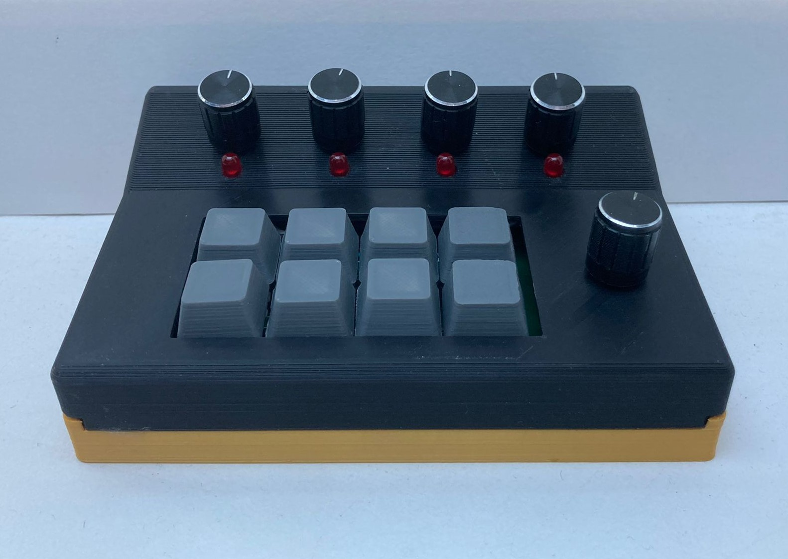
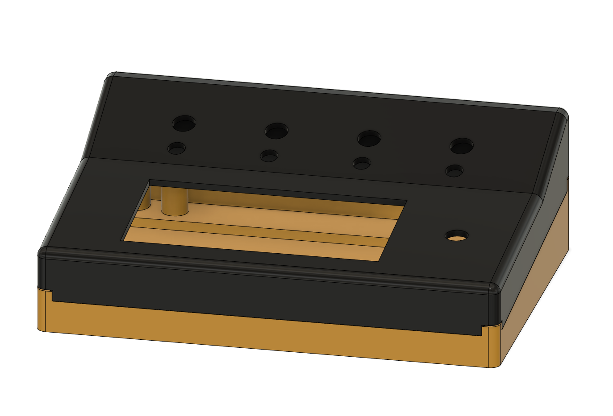
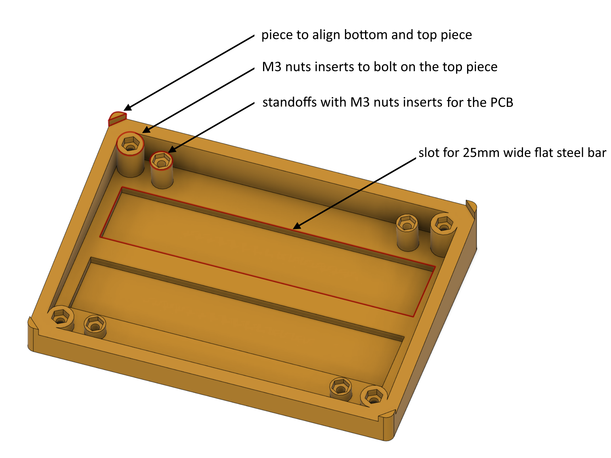
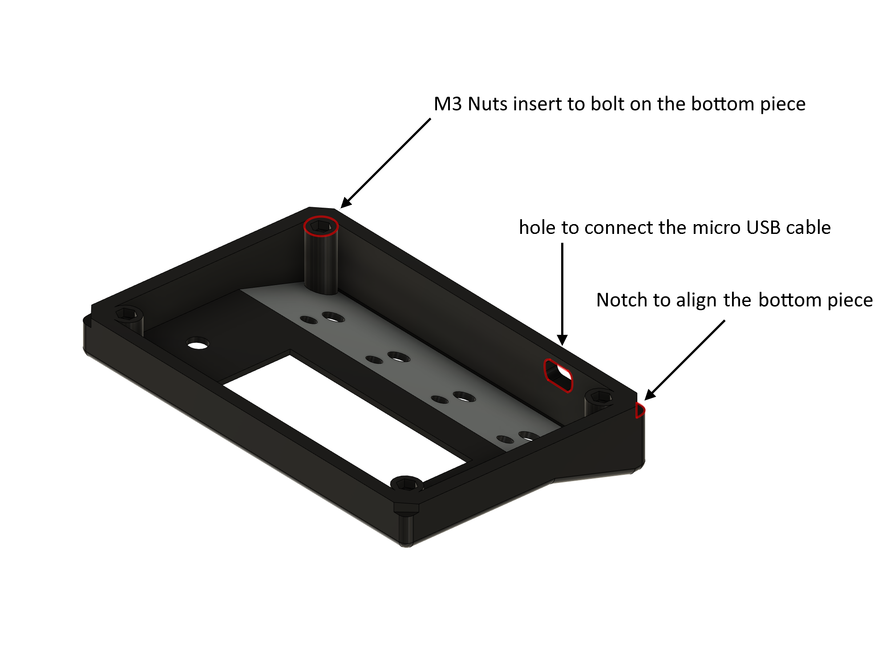
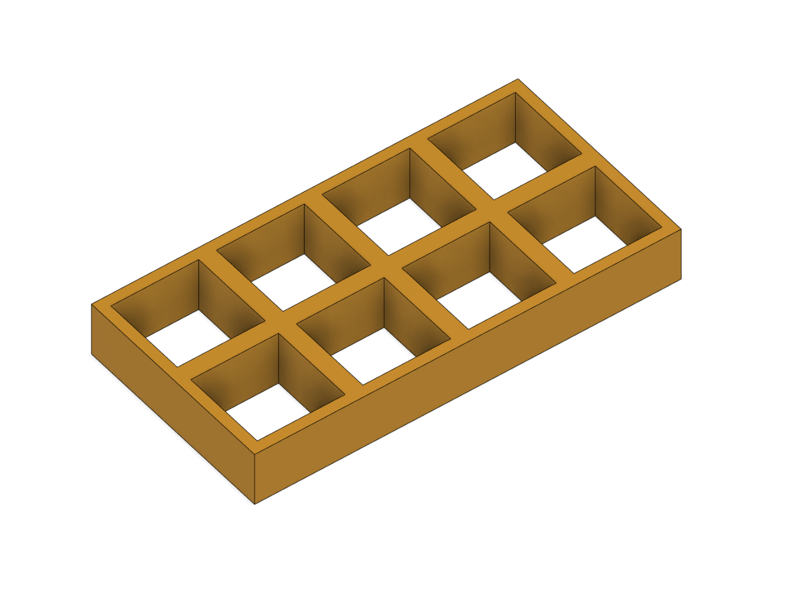

# F24 Macro keypad 
## Table of contents
1. [Introduction](#introduction)
2. [why did I built this ?](#why)
3. [how does it works ?](#how)
4. [3D Printing](#3D)
    + [Case](#case)
    + [keycaps](#keycaps)
5. [Electronics](#electronics)
    + [Design](#design)
    + [Routing](#routing)
    + [Soldering/Assembly](#soldering)
6. [Software](#software)
    + [Arduino Code](#code)
    + [Auto Hotkey script](#ahk)
7. [Things that can be improved](#improve)


<div id="introduction">

## Introduction 
This is the F24 macro keypad, with 8 mechanical keys to bind macros and 5 rotary encoders to control app sound volume.




<div id="why">

## Why did I built this ? 
I had the idea to build this during lockdown, at the time I played different video games, sometimes while listening to music, chatting with friends on discord or watching Youtube videos.</br>
I also attended online classes on Zoom, Discord or Microsoft Teams.</br>
That meant I had to open the windows sound mixer every time to manage sound volume and it got a bit too annoying. 

<div id="how">

## how does it works ? 

+ It uses an Arduino "Pro Micro" (ATmega32U4) to send keystrokes through USB</br> 
It turns out that keys `F13` to `F24` are still suported by Windows (they were used on some very old keyboards), it's a easy and simple way to send keystrokes while never interfering with other applications. </br></br>

+ The recieved keystrokes are assigned to actions like Spotify volume up, next track, launch a specific app... But it could be anything thanks to the power of [Autohotkey](https://www.autohotkey.com/) </br> 

<div id="3D">

## 3D printing

<div id="case">

### Case



Before printing the case in whole try printing the "test-fit" pieces provided because every printer is different and you might have to modify inserts holes size slightly.
+ **the bottom piece**</br></br>
    - I recommend using super glue to place the M3 nuts. **Don't use a soldering iron** because it will uncenter the nut and you won't be able to bolt the bottom to the top.</br>
    - Use 12mm long M3 Bolts for every hole.</br>
    - The 2 flat steel bars are not mandatory but it adds weight and makes the keypad more stable when you use the encoders </br>




+ **the top piece**</br></br>
  <span style="background-color: #FFEB89">This part can be improved, read "[Things that can be improved](#improve)" </span>
    - Use the same M3 nuts
    - Use ironing setting in your slicer to make the top part smooth



<div id="keycaps">

### Keycaps

You can either print keycaps upright or upside down. There are pros and cons 
to both options.</br>
For best result, use an SLA 3D printer.<br/>
You can also buy injection molded keycaps.
 

| printed upright   | printed upside down |
| :---------------: | :-----------------: |
|||
|||
|When printing this way, the key is harder to mount on the switch but doesn't come off so easily, it also has a very smooth and flat top with ironing setting is enabled.|When printing this way, the key is easier to mount on the switch but comes off too easily , it has a textured top whose quality depends on the first layer and bed texture. |

<div id="electronics">

## Electronics

<div id="design">

### Design

<div id="routing">

### Routing

<div id="soldering">

### Soldering/Assembly

The soldering process is very straight forward, the only parts you have to solder carefully are the switches, they need to be properly aligned and spaced out by using the 3D printed grid. Also **make sure the switches are very flat against the PCB**. **You have to solder them first** otherwise you won't be able to use the grid.</br>  
<div id="software">

## Software

<div id="code">

### Arduino Code

+ libraries

    Uses the `Keyboard.h` which uses the `HID.h` library to send keystrokes over USB.

+ functions:
    
    - ```cpp
        bool read_mux(int address);
        ```
        Returns the multiplexer output for a given address.</br></br> 
    - ```cpp
        int read_PB_encoder(int num_encoder);
        ```
        Returns `true` if the encoder is pushed.</br>
        Returns `false` if it's not.</br></br>
    - ```cpp
        int read_encoder(int num_encoder);
        ```
        Returns `2` if the encoder is rotated one step counter clockwise.</br>
        Returns `1` if the encoder is rotated one step clockwise.</br>
        Returns `0` if the encoder is not rotated.</br></br>
    - ```cpp
        bool read_kbd(int x, int y);
        ```
        Returns `true` if the selected key is pushed.</br>
        Returns `false` if it's not.</br></br>   
    - ```cpp
        void kbd_cmd(int address);
        ```
        sends the right `KEY_FXX` combination</br>
        (*Keys and encoders are assigned like follows*)
        - Encoders

            | encoder | output (clockwise)   | output           (clockwise)  |    output (pushed)   |
            |--------:| :-------------------:|          :------------------:|:--------------------:|
            | 1       | `KEY_F24`            |          `KEY_F23`           | `KEY_F20`            |
            | 2       | `KEY_F24 && KEY_F23` |          `KEY_F22`           | `KEY_F24 && KEY_F20` |
            | 3       | `KEY_F24 && KEY_F22` | `KEY_F23 &&          KEY_F22`| `KEY_F23 && KEY_F20` |
            | 4       | `KEY_F21`            | `KEY_F24 &&          KEY_F21`| `KEY_F22 && KEY_F20` |
            | 5       | `KEY_F23 && KEY_F21` | `KEY_F22 &&          KEY_F21`| `KEY_F21 && KEY_F20` |


        - Keys

            | row/column | col 1                | col           2               |col 3                |col          4                | 
            | ----------:| :-------------------:|           :------------------:|:-------------------:|         :-------------------:|
            | row 1      | `KEY_F19`            | `KEY_F24 &&           KEY_F19`| `KEY_F23 && KEY_F19`| `KEY_F22 &&         KEY_F19`|
            | row 2      | `KEY_F21 && KEY_F19` | `KEY_F20 &&           KEY_F19`| `KEY_F18`           | `KEY_F24 &&         KEY_F18`|
     
    - ```cpp
        void loop();
        ```
        Reads everything one by one by using the functions described before.


<div id="ahk">

### Auto Hotkey Script

The shortcut that are executed are placed between `FXX & FXX::` and `return`

+   Some examples are :
    -   ```ahk
        Send {Media_Prev}
        ```
    -   ```ahk
        Send {Media_Play_Pause}
        ```
    -   ```ahk
        Send {Media_Next}
        ```
        Plays previous track, play/pauses or plays next track (windows feature)</br></br>
    - ```ahk
        appVolume("Brave.exe", -5);
        ```
        Changes the sound level of `Brave.exe` by 5% increments. ***Note that you will need to use one function per app***, otherwise theses functions are going to interfere with each others. ex:`appVolume2("Discord.exe", -5);
        `,`appVolume3("Spotify.exe", -5);`etc...</br></br>
    - ```ahk
        WinGet, ActivePID, PID, A 
        SetAppVolume(ActivePID, GetAppVolume(ActivePID) - 5);
        ```
        Changes the sound level of the focused app by 5% increments </br>
        unfortunatelly ***this command doesn't work with every app***, (ex: Discord, Chrome).
        </br></br>
    - You can create your own sortcuts , read [AutoHotkey documentation](https://www.autohotkey.com/docs/AutoHotkey.htm)   

**To use the script**, you need to make it so the script runs when windows starts. To do so : Make sure [AutoHotkey](https://www.autohotkey.com/) is installed. Press **Win+R** then run: `shell:startup` then place the `script.ahk` in the startup folder.

<div id="improve">

## Things that can be improved
